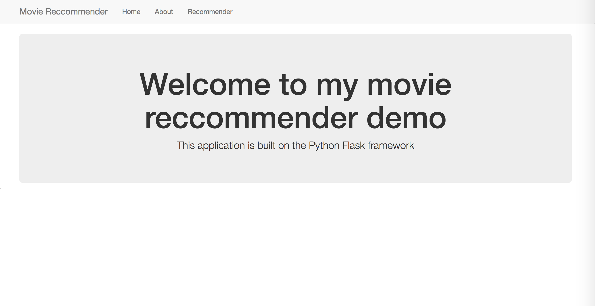
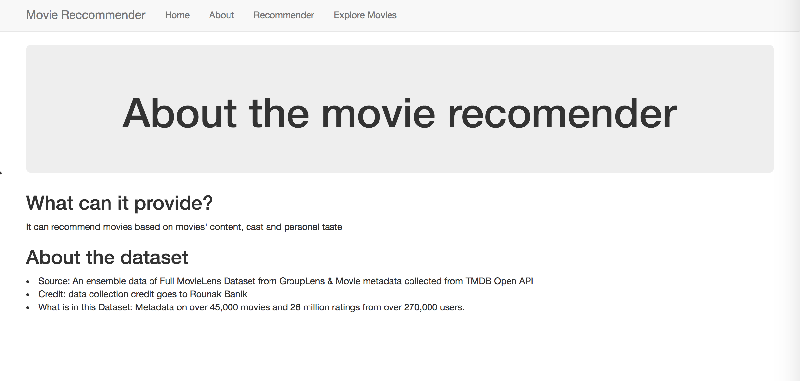

## Movie Recommender Project  
A  recommendation system using content-based & collaborative filtering methods.  

[Data Source:](https://www.kaggle.com/rounakbanik/the-movies-dataset/data)

methods: 
* content-based: NLTK, scikit-learn
* collaborative filtering: surprise, pyspark(final demo)

demo: flask(finished), mySQL(final demo), Spark(final demo)

Current demo:  
  
  
Home page:  
  
About page:  
  
Recommendation example:  

TODO list:   
* [x] Build local host demo website(flask)  
* [ ] Add mySQL to store similarity matrix 
* [ ] Use pySpark machine learning library to implement collaborative filtering  
* [ ] Save similarity matrix in mySQL database  
* [ ] Using pyspark library to do collaborative filtering instead of surprise.SVD
